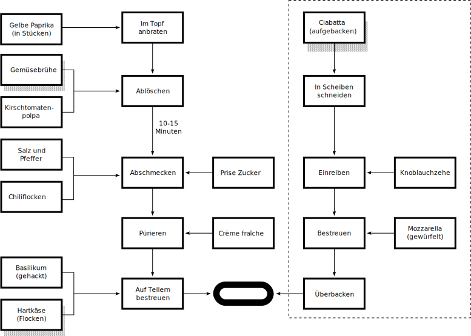

<table class="headertable">
	<tbody>
		<tr>
			<td colspan="2" rowspan="8"><h1>Tomaten-Paprika Suppe</h1></td>
			<td>1</td>
			<td>Gelbe Paprika</td>
		</tr>
		<tr>
			<td>4g</td>
			<td>Gemüsebrühe</td>
		</tr>
		<tr>
			<td>1</td>
			<td>Ciabatta</td>
		</tr>
		<tr>
			<td>1 Zehe</td>
			<td>Knoblauch</td>
		</tr>
		<tr>
			<td>100ml</td>
			<td>Kirschtomatenpolpa</td>
		</tr>
		<tr>
			<td>2g</td>
			<td>Chilliflocken</td>
		</tr>
		<tr>
			<td>10g</td>
			<td>Basilikum</td>
		</tr>
		<tr>
			<td>20g</td>
			<td>Hartkäse</td>
		</tr>
		<tr>
			<td>Zubereitungszeit</td>
			<td>30 Minuten</td>
			<td>75g</td>
			<td>Crème fraîche</td>
		</tr>
		<tr>
			<td>Komplexität</td>
			<td>2/10</td>
			<td>1</td>
			<td>Mozarrella</td>
		</tr>
		<tr>
			<td>Energie</td>
			<td>760kcal</td>
			<td></td>
			<td>Zucker</td>
		</tr>
		<tr>
			<td>Herkunft</td>
			<td>-</td>
			<td></td>
			<td>Salz & Pfeffer</td>
		</tr>
	</tbody>
</table>

<!-- cmdrun "${CMD_DRAW_HEADTABLE:=echo}" ./tomatensuppe.yml -->
<!-- cmdrun "${CMD_DRAW_NUTRIENTS:=echo}" ./tomatensuppe.yml -->

## Durchschnittliche Nährwärte pro 100g
- Brennwert 461kJ/110kcal
- Fett 4,98g
- Kohlenhydrate 11,21g
- Eiweiß  4,39

